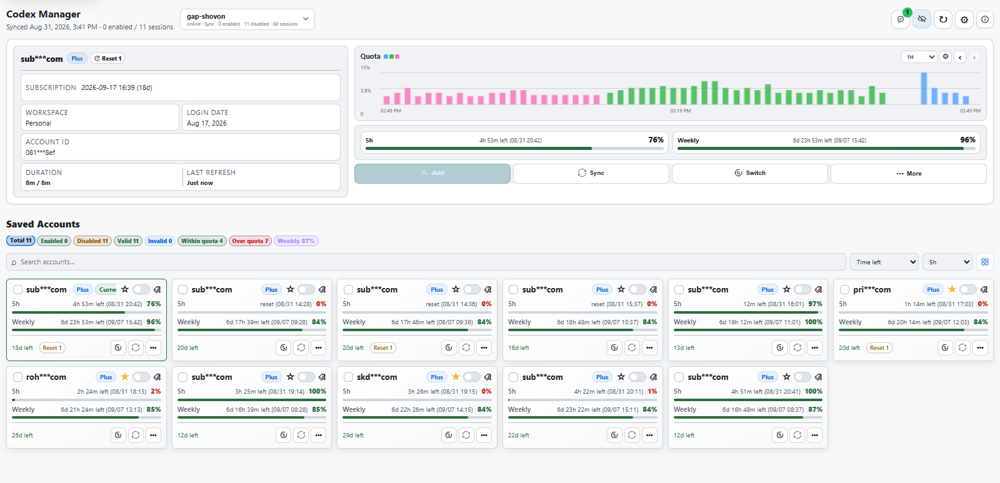
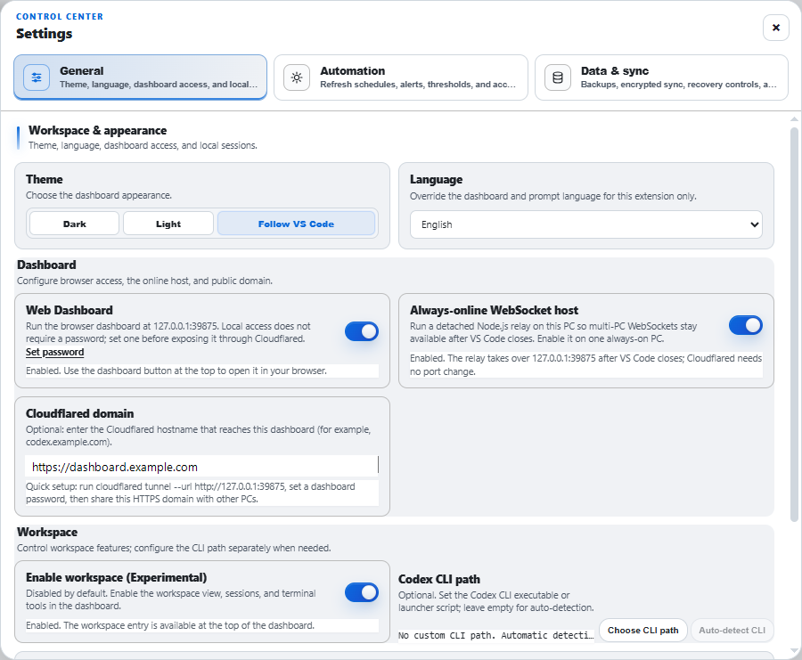
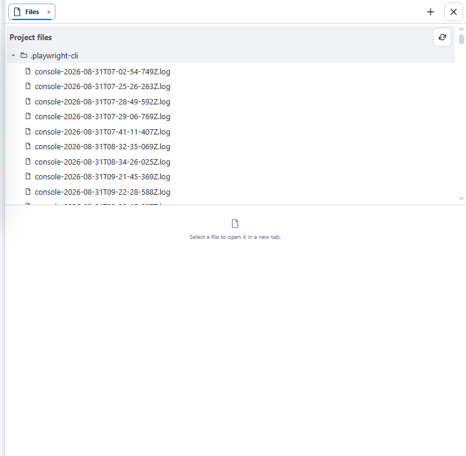

# Codex Manager

Codex Manager is a local-first Visual Studio Code extension for managing multiple Codex accounts, checking quota, switching the active `auth.json`, and continuing Codex CLI work across VS Code windows.

It is an independent, community project. It is not an official OpenAI product.

## What it provides

- Account vault: add accounts with OAuth, import the current `auth.json`, remove accounts, and restore backups.
- Quota view: 5-hour, weekly/monthly, and code-review windows with reset times and usage history.
- Safe switching: choose an account manually or enable threshold-based automatic switching.
- Dashboard: a VS Code webview plus an optional password-protected browser dashboard.
- Session tools: inspect local Codex CLI sessions through a read-only transcript viewer, send messages, start/stop Manager-owned turns, and fork sessions when CLI integration is enabled. Opening a session in the official Codex extension remains an explicit action.
- Encrypted sync: share the account vault and per-device enablement through VS Code Settings Sync using the shared password.
- Diagnostics: structured, redacted JSONL logs with operation IDs and failure outcomes.

See the complete feature and setting reference in [`docs/FEATURES.md`](docs/FEATURES.md).

## See it in action

The screenshots below use representative, privacy-safe data so you can preview the main surfaces before installing.



*Dashboard — compare account health, quota windows, and reset times at a glance.*



*Settings — configure appearance, dashboard access, automation, sync, and workspace features in one place.*



*Workspace — keep sessions and project files together, with full-height tabs for Files, Reviews, and Terminal.*

## Requirements

- VS Code 1.96 or newer.
- A working Codex installation and a writable `CODEX_HOME` (the default Codex location is used when `CODEX_HOME` is not set).
- Node.js 20 or newer only when building from source.
- A signed-in VS Code Settings Sync account for encrypted sync.
- `cloudflared` only when publishing the browser dashboard outside the local machine.

## Install

### Marketplace

Install **Codex Manager** from the [Visual Studio Marketplace](https://marketplace.visualstudio.com/items?itemName=imskriaz.codex-manager).

### VSIX

Download a release VSIX, then run **Extensions: Install from VSIX...** in VS Code. From a terminal:

```bash
code --install-extension codex-manager-<version>.vsix
```

### Build from source

```bash
git clone https://github.com/imskriaz/codex-manager.git
cd codex-manager
npm ci
npm run compile
```

Press `F5` in VS Code to open an Extension Development Host. Use `npm test` and `npm run verify` before distributing a build. Packaging is intentionally not part of the normal setup flow; run `npm run package` only when you are preparing a VSIX.

## First run

1. Open the Command Palette (`Ctrl+Shift+P` / `Cmd+Shift+P`).
2. Run **Codex Manager: Add Account via OAuth** and finish the browser login. For an already configured Codex installation, use **Import Current auth.json** instead.
3. Open the Codex Manager dashboard from the status-bar item or **Codex Manager: Show Quota Summary**.
4. Select an account and run **Switch Account**. The extension updates the machine-wide Codex `auth.json`; restart the Codex desktop app when prompted.
5. Use **Refresh Quota** after login or account changes. Enable scheduled refresh only if you want background requests.

Every user-started action ends with a visible success, warning, cancellation, or failure message. If an action fails, open **Codex Manager: Open Persistent Logs** and include the operation ID when reporting it.

## Commands

Open the Command Palette and search for `Codex Manager`.

| Command | Use |
| --- | --- |
| Add Account via OAuth | Authorize and save a new account. |
| Import Current auth.json | Save the account currently used by Codex. |
| Switch Account | Write a saved account to the active Codex credential file. |
| Refresh Quota / Refresh All Quotas | Refresh one account or every enabled account. |
| Restore Accounts from Backup | Restore the extension’s native backup format. |
| Restore Accounts from auth.json | Import accounts from a Codex credential file. |
| Restore Accounts from Shared JSON | Import a JSON export created on another machine. |
| Remove Account | Delete a saved account after confirmation. |
| Open Details | Show account identity, subscription, quota, and usage history. |
| Open Codex Home | Open the configured `CODEX_HOME` folder. |
| Show Quota Summary | Open the VS Code dashboard. |
| Keyboard Shortcuts & Help | View dashboard shortcuts and help. |
| Open Latest Session in VS Code | Open the newest local CLI session. |
| Sync Sessions Now | Run encrypted Settings Sync using the shared password configured in General. |
| Open Persistent Logs | Open the current redacted JSONL diagnostic log. |

## Browser dashboard and Cloudflare

The browser dashboard is disabled by default and listens on `http://127.0.0.1:39875` when enabled. In the dashboard Settings:

1. Turn on **Web dashboard**.
2. Set the shared **Password** in General; remote dashboard login and encrypted sync use that same password.
3. If the dashboard must remain available after VS Code closes, turn on **Always-online WebSocket host** on one always-on PC.
4. For a public HTTPS address, set **Cloudflared domain** to the final URL (for example `https://codex.example.com`) and configure the tunnel to forward to `http://127.0.0.1:39875`.

Follow the complete Windows and named/quick tunnel walkthrough in [`docs/CLOUDFLARE.md`](docs/CLOUDFLARE.md). Read Cloudflare’s [Tunnel overview](https://developers.cloudflare.com/cloudflare-one/networks/connectors/cloudflare-tunnel/), [downloads](https://developers.cloudflare.com/cloudflare-one/networks/connectors/cloudflare-tunnel/downloads/), [remotely-managed tunnel guide](https://developers.cloudflare.com/cloudflare-one/networks/connectors/cloudflare-tunnel/get-started/create-remote-tunnel/), and [Quick Tunnels guide](https://developers.cloudflare.com/cloudflare-one/networks/connectors/cloudflare-tunnel/do-more-with-tunnels/trycloudflare/) first.

Cloudflare Tunnel exposes the dashboard’s HTTP and WebSocket endpoints. It does **not** expose raw MQTT/TCP; devices that use MQTT still need a separately reachable broker.

## Settings

All settings use the `codexManager.*` namespace. The dashboard explains each control; the full table with defaults and safe combinations is in [`docs/FEATURES.md`](docs/FEATURES.md).

Important combinations:

- **CLI integration** enables dashboard session discovery and controls. It does not perform automatic CLI resume.
- **Encrypted sync** requires VS Code Settings Sync and the same password on each machine. The password is never uploaded by the extension.
- **Automatic switching** is off by default. Set the hourly control on only if the 5-hour window should affect switching and status-bar warnings.
- **Always-online host** is optional and requires encrypted sync before it can relay signed peer state.
- **Cloudflared domain** is only a display/configuration value; the `cloudflared` process and DNS route are managed by you.

## Privacy and security

- Account tokens remain in local VS Code SecretStorage and the Codex credential file. They are not sent to a Codex Manager server.
- Encrypted sync stores an encrypted vault in VS Code Settings Sync. Vault changes are durably queued for a short five-second debounce, while the authenticated peer WebSocket delivers encrypted changes immediately when PCs are online. Settings Sync remains the durable fallback; newly downloaded vaults are applied while VS Code stays open, and Sync Sessions Now forces a download/merge/upload pass. Signed peer WebSocket/HTTP updates carry enablement and dashboard state in realtime without consuming Settings Sync requests. Account usage, switching, quota refreshes, and schedules do not generate durable sync traffic.
- The browser dashboard is local-only until enabled. Never expose port `39875` without the shared password and HTTPS access control.
- Persistent logs redact tokens and account identifiers and retain the current UTC day plus the previous two days.
- Review the [MIT License](LICENSE) and only manage accounts you own or are authorized to use.

## Troubleshooting

- **No accounts appear:** import the current `auth.json`, or complete OAuth again. Confirm `CODEX_HOME` points to the same Codex installation.
- **Quota refresh fails:** run **Refresh Quota**, check your network/proxy settings, and inspect **Open Persistent Logs** for the operation ID.
- **Switch did not affect Codex:** close/restart the Codex desktop app or enable the extension’s app-restart setting. Verify the active `auth.json` in **Open Codex Home**.
- **Browser dashboard cannot connect:** confirm Web dashboard is enabled, the shared Password is configured in General, and the Cloudflare route points to `http://127.0.0.1:39875`.
- **Sessions are missing:** enable CLI integration, verify the configured Codex CLI path, and confirm the Codex session index exists.

## Documentation map

- [`docs/FEATURES.md`](docs/FEATURES.md) — feature, workflow, and settings reference.
- [`docs/CLOUDFLARE.md`](docs/CLOUDFLARE.md) — secure local, quick-tunnel, and named-tunnel setup.
- [`CHANGELOG.md`](CHANGELOG.md) — human-focused notes for the current release.

## License

Codex Manager is available under the [MIT License](LICENSE). The project was originally based on [codex-manager](https://github.com/wannanbigpig/codex-manager).
